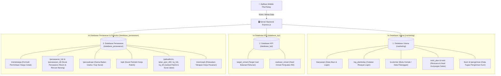
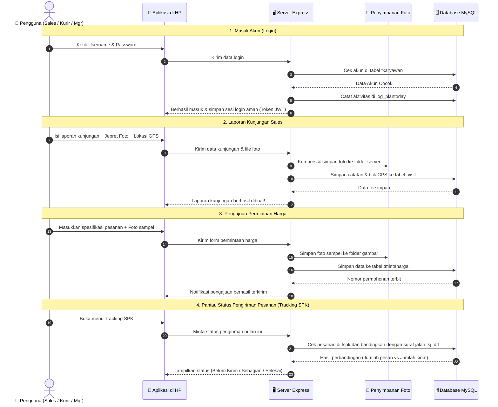

# PlanToday - REST API Backend Server

Backend PlanToday adalah layanan REST API server yang dibangun menggunakan **Express.js (Node.js)**. Server ini bertindak sebagai pusat logika bisnis dan jembatan data untuk aplikasi mobile client PlanToday, dengan mengintegrasikan 3 database MySQL yang terpisah.

---

## 🛠️ Tech Stack & Dependensi Utama

- **Core Framework**: Express.js (v5.x)
- **Runtime**: Node.js (versi `>= 20`)
- **Database Driver**: `mysql2/promise` (Connection Pooling)
- **Keamanan & Autentikasi**:
  - `jsonwebtoken` (JWT) untuk sesi token tanpa state (stateless authentication).
  - `bcryptjs` untuk utilitas enkripsi.
- **Manajemen File & Gambar**:
  - `multer` untuk multipart upload (foto kunjungan, bukti pengiriman kurir, gambar sampel permintaan harga).
  - `sharp` untuk kompresi, rotasi otomatis, dan optimasi gambar.
- **Utilitas**: `cors`, `dotenv`, `nodemon` (development).

---

## 🗄️ Database & Hubungan (Relasi) Antar Tabel

Sistem PlanToday menggunakan **3 database terpisah** agar data tersusun rapi sesuai fungsinya:
1. **Database Utama (`marketing`)**: Mengurus data karyawan, data pelanggan, kunjungan sales, dan kurir.
2. **Database KPI (`database_kpi`)**: Mengurus data target penjualan dan rapor pencapaian sales.
3. **Database Penawaran & Produksi (`database_penawaran`)**: Mengurus permintaan harga, surat penawaran, hingga status produksi pesanan pabrik.



---

### 📖 Cerita Relasi (Hubungan) Antar Tabel Secara Sederhana

Agar mudah dipahami oleh pengguna umum, berikut adalah gambaran bagaimana tabel-tabel di atas saling terhubung dalam aktivitas kerja sehari-hari:

1. **Alur Karyawan, Pelanggan, & Kunjungan Lapangan**:
   - **Sales Login**: Akun sales login melalui data di `tkaryawan`. Setiap kali masuk, sistem mencatat riwayat login di `log_plantoday`.
   - **Data Pelanggan**: Sales mendaftarkan calon pembeli baru ke buku kontak pelanggan (`tcustomer`).
   - **Rencana Kunjungan**: Sales membuat jadwal rencana visit (`tvisit_plan`) yang ditujukan ke pelanggan tertentu di `tcustomer`.
   - **Laporan Kunjungan Nyata**: Saat sales tiba di lokasi pelanggan, sales melakukan *check-in* (`tvisit`). Sistem menyimpan foto bukti pertemuan, catatan hasil obrolan, dan titik GPS koordinat langsung.

2. **Alur Permintaan Harga ke Surat Penawaran Resmi**:
   - **Minta Hitung Harga**: Jika pelanggan tertarik memesan produk cetak/custom, sales membuat formulir permintaan harga (`tmintaharga`) lengkap dengan foto contoh produk.
   - **Penerbitan Surat Penawaran**: Setelah bagian estimasi selesai menghitung harga, diterbitkan Surat Penawaran Resmi:
     - Bagian kepala/kop surat (nomor surat, nama pelanggan, total biaya, diskon, PPN) tersimpan di `tpenawaran_hdr` menggunakan profil perusahaan dari `tperusahaan`.
     - Daftar rincian barang per baris (nama barang, jumlah pesanan, harga satuan) tersimpan di `tpenawaran_dtl`.

3. **Alur dari Penawaran Deal ke Produksi Pabrik & Pengiriman (SPK)**:
   - **Terbit SPK**: Jika pelanggan setuju dengan surat penawaran, penawaran tersebut naik status menjadi Surat Perintah Kerja (`tspk`) untuk dikerjakan pabrik.
   - **Jadwal Pabrik**: Tim PPIC/Produksi mengatur target kapan pesanan akan selesai dan siap kirim (`tplan_ppic_dtl2` dan `tjadwalkirim`).
   - **Pengiriman Barang**: Saat barang selesai dicetak dan diantar, diterbitkan Surat Jalan (`tsj_hdr` untuk nomor surat jalan dan `tsj_dtl` untuk rincian jumlah barang yang dibawa).
   - **Pelacakan Status Pengiriman**: Sistem secara otomatis membandingkan jumlah barang yang dipesan di `tspk` dengan barang yang sudah dikirim di `tsj_dtl`:
     - *Belum Kirim*: Belum ada surat jalan terbit sama sekali.
     - *Sebagian*: Barang baru dikirim sebagian (belum lengkap).
     - *Selesai*: Semua jumlah barang pesanan sudah tuntas dikirim.

4. **Alur Rapor Penjualan & Target Omset (KPI)**:
   - Manajemen menentukan target penjualan per sales per bulan di `target_omset`.
   - Hasil transaksi penjualan yang berhasil dicatat di `realisasi_omset`.
   - Sistem membagi nilai realisasi dengan target untuk menampilkan persentase rapor kinerja (*Achievement %*) dalam bentuk grafik yang mudah dibaca.

5. **Alur Pengiriman Kurir**:
   - Kurir melihat daftar tugas paket/surat jalan yang harus diantar (`tpengiriman`).
   - Saat paket diserahkan ke pelanggan, kurir mengambil foto bukti penerimaan (*Proof of Delivery*) dan koordinat lokasi penyerahan.

---

## 🔄 Alur Perjalanan Data (Dari HP Pengguna ke Database)



---

## 📂 Struktur Direktori Proyek

```
PlanToday-backend/
├── config/              # Konfigurasi koneksi MySQL pool (dbMain, dbAch, dbPenawaran)
├── controllers/         # Logika bisnis API dan eksekusi query database
│   ├── achController.js              # Perhitungan omset & KPI
│   ├── authController.js             # Autentikasi user & JWT
│   ├── homeController.js             # Customer & Visit management
│   ├── kurirController.js            # Operasional & bukti kirim kurir
│   ├── penawaranController.js        # Pembuatan & approval penawaran harga
│   ├── permintaanHargaController.js  # Permintaan harga & upload sampel
│   ├── trackingMapController.js      # Tracking posisi memo SPK
│   ├── trackingPenawaranController.js# Monitoring status penawaran
│   └── trackingSpkController.js      # Monitoring komitmen & realisasi SPK
├── middleware/          # Middleware Express (Auth JWT, Logger, Multer Upload)
├── routes/              # Routing endpoint REST API
├── uploads/             # Direktori penyimpanan file upload (bukti kunjungan & kurir)
├── image/               # Direktori penyimpanan gambar permintaan harga
├── utils/               # Utilitas pembantu (resolusi nama sales, normalisasi tanggal)
├── docs/                # Dokumentasi tambahan & checklist deployment VPS
├── .env.example         # Template konfigurasi environment
├── package.json         # Konfigurasi dependensi Node.js
└── server.js            # Entry point utama aplikasi
```

---

## ⚙️ Panduan Instalasi & Konfigurasi

### 1. Prasyarat Sistem
- **Node.js**: Versi `>= 20.x`
- **Database**: Server MySQL aktif

### 2. Instalasi Dependensi
```bash
npm install
# atau untuk instalasi berbasis lockfile
npm ci
```

### 3. Konfigurasi Environment (`.env`)
Salin file template `.env.example` menjadi `.env` lalu sesuaikan kredensial database dan port server:

```env
# 1. Konfigurasi Database Utama (marketing)
DB_HOST_MAIN=127.0.0.1
DB_USER_MAIN=db_user_placeholder
DB_PASSWORD_MAIN='db_password_placeholder'
DB_NAME_MAIN=marketing
DB_PORT_MAIN=3306

# 2. Konfigurasi Database Achievement & KPI (database_kpi)
DB_HOST_ACH=127.0.0.1
DB_USER_ACH=db_user_placeholder
DB_PASSWORD_ACH='db_password_placeholder'
DB_NAME_ACH=database_kpi
DB_PORT_ACH=3306

# 3. Konfigurasi Database Penawaran & SPK (database_penawaran)
DB_HOST_PENAWARAN=127.0.0.1
DB_USER_PENAWARAN=db_user_placeholder
DB_PASSWORD_PENAWARAN='db_password_placeholder'
DB_NAME_PENAWARAN=database_penawaran
DB_PORT_PENAWARAN=3306

# 4. Port Server & Rahasia JWT Token
PORT=3001
JWT_SECRET=your_jwt_secret_token_key_here
```

---

## 💻 Menjalankan Server

### Mode Development (Auto-Reload)
```bash
npm run dev
```

### Mode Production
```bash
npm run start
```

### Manajemen Proses VPS dengan PM2
```bash
# Menjalankan service API di background
pm2 start server.js --name plantoday-api

# Memantau logs server
pm2 logs plantoday-api

# Melihat status service
pm2 status
```

---

## 🔒 Keamanan & Kebijakan Kredensial

- Seluruh kredensial database dan rahasia enkripsi JWT disimpan secara terisolasi di dalam file `.env` yang diabaikan oleh Git (`.gitignore`).
- Endpoint yang memerlukan identifikasi data pribadi/perusahaan wajib menyertakan token otorisasi Bearer JWT yang valid.
- Upload berkas divalidasi berdasarkan tipe MIME dan ukuran maksimum file untuk mencegah eksploitasi server.
